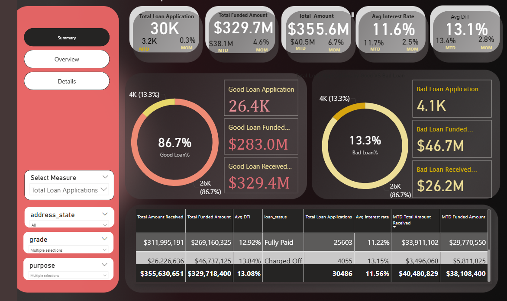
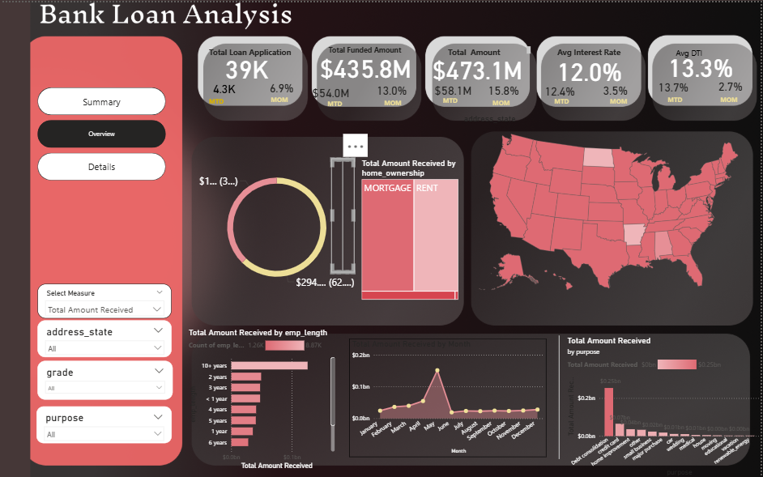
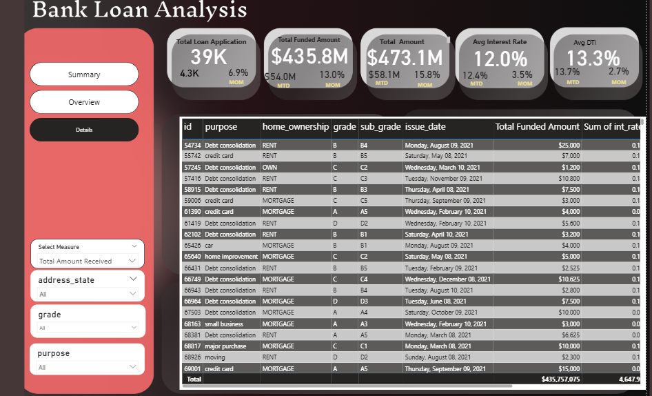

# 📊 Bank Loan Analysis  

## 📌 Project Overview  
This project focuses on **Bank Loan Data Analysis** for monitoring and evaluating the performance of a financial institution’s loan portfolio. The goal is to track loan applications, funded amounts, repayments, interest rates, and borrower profiles using **Python, SQL, and Power BI**.  

The project provides **actionable insights** through interactive dashboards, enabling banks to make informed decisions about lending, repayments, and risk management.  

---

## ⚙️ Tech Stack  
- **Python** – Data cleaning, preprocessing, and exploratory data analysis (EDA).  
- **SQL** – Data extraction, transformation, and querying from relational databases.  
- **Power BI** – Interactive dashboard and visualization reporting.  

---

## 🎯 Problem Statement  
Banks need to understand and monitor the performance of loans to **reduce risks** and **maximize returns**. This project answers:  

1. How many loans were applied and funded over time?  
2. How much has been received back from borrowers?  
3. What are the **Good vs. Bad Loan ratios**?  
4. How do loan purposes, borrower employment length, and home ownership affect loan performance?  
5. Which regions show higher or lower lending activity?  

---

## 📊 Key Performance Indicators (KPIs)  
- **Total Loan Applications**  
- **Total Funded Amount**  
- **Total Amount Received**  
- **Average Interest Rate**  
- **Average Debt-to-Income (DTI) Ratio**  
- **Good Loan % vs. Bad Loan %**  

---

## 📑 Dashboard Features  

### 🔹 Summary View  
- Total Applications, Funded Amount, Received Amount.  
- Good vs. Bad Loan Analysis.  
- Month-to-Date (MTD) metrics.  

### 🔹 Overview View  
- **Monthly Trends** (line/area chart).  
- **Regional Analysis** by state.  
- **Loan Term Distribution** (donut chart).  
- **Employment Length Analysis** (bar chart).  
- **Loan Purpose Breakdown** (bar chart).  
- **Home Ownership Impact** (tree/heat map).  

### 🔹 Details View  
- Loan-level details with filters (State, Purpose, Grade).  
- Drill-down capability for deeper insights.  

---

## 🔎 Findings & Results  

1. **Loan Applications & Funding**  
   - Total Applications: **~39K**  
   - Total Funded Amount: **~$435M**  
   - Total Amount Received: **~$473M**  

2. **Interest Rate & Borrower Health**  
   - Average Interest Rate: **~12%**  
   - Average DTI Ratio: **~13%**  

3. **Good vs. Bad Loans**  
   - Good Loans: **87% of applications (~26.4K loans)**  
   - Bad Loans: **13% of applications (~4.1K loans)**  
   - ✅ Repayments from Good Loans exceed funded amounts → Portfolio is healthy.  

4. **Loan Purpose**  
   - **Debt Consolidation** dominates, followed by **Credit Card** and **Home Improvement**.  

5. **Regional Insights**  
   - Higher loan volumes in **highly populated states**.  
   - Lower lending activity in Midwest & South regions.  

6. **Borrower Profile**  
   - **Mortgage/Rent** borrowers dominate.  
   - Borrowers with **10+ years employment** contribute the highest loan amounts.  

7. **Trends**  
   - Seasonal spikes in loan issuance (~April–May).  
   - Repayment cycles align with issuance trends.  

---

## ✅ Business Impact  
- Provides **clear visibility** into portfolio health.  
- Helps in **identifying high-risk borrowers**.  
- Supports **data-driven lending and collection strategies**.  
- Improves **profitability by reducing default risks**.  

---

## 💡 Recommendations  
1. Focus lending on **borrowers with stable employment** (5+ years).  
2. Closely monitor **Debt Consolidation loans**, as they form the largest segment.  
3. Implement **regional risk-based pricing** in states with higher defaults.  
4. Strengthen **loan recovery strategies** for the 13% bad loans.  

---

## 🚀 How to Run the Project  

### 1. Database Setup  
- Import loan dataset into SQL Server/MySQL/Postgres.  
- Run provided SQL scripts for cleaning & aggregations.  

### 2. Python Preprocessing  
```bash
pip install pandas numpy matplotlib seaborn
jupyter notebook
```
- Run Python notebooks for cleaning & EDA.  
- Export processed dataset for Power BI.  

### 3. Power BI Dashboard  
- Open `.pbix` file in Power BI Desktop.  
- Connect to processed dataset or SQL database.  
- Explore interactive dashboards.  

---

## 📷 Dashboard Previews  
### 🔹 Summary View  
  

### 🔹 Overview View  
  

### 🔹 Details View  
  

---

## 📂 Project Structure  
```
📁 Bank Loan Analysis  
│── 📊 SQL Scripts (Queries & preprocessing)  
│── 🐍 Python Notebooks (Data cleaning & EDA)  
│── 📈 Power BI Dashboard (.pbix file)  
│── 📄 Problem Statement.pptx (Documentation)  
│── 📷 Images (Dashboard screenshots)  
│── README.md (This file)  
```

---

## 📌 Conclusion  
This project demonstrates how **Python + SQL + Power BI** can be integrated for **end-to-end financial analytics**. By analyzing KPIs, Good vs. Bad Loans, and borrower profiles, banks can **minimize risks, improve loan recovery, and optimize lending strategies**.  
